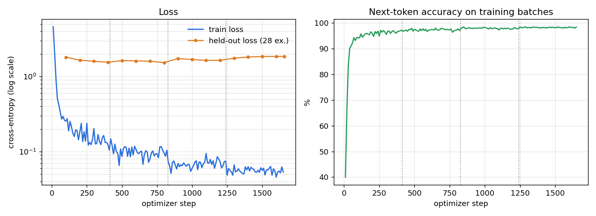

# Ganesh LLM — Gemma 3 1B (on-device, LiteRT)

An offline assistant for Ganeshotsav that recites Shri Ganesha's aartis, stotras and shlokas
**word for word**, and answers questions on rituals, stories and the festival in Marathi, Hindi
and English. No internet, no retrieval: everything lives in the weights.

* **File:** `ganesh-gemma3-1b-v2.litertlm` — 1.0 GB, runs in
  [Google AI Edge Gallery](https://github.com/google-ai-edge/gallery) on Android.
* **Why 1B:** the earlier Gemma 4 E2B build (4.7 GB) worked in Edge Gallery but was too slow on a
  phone. This is the same data on a model ~4-5x smaller.

## Files

| file | what it is |
|---|---|
| `ganesh-gemma3-1b-v2.litertlm` | **Use this.** Fine-tuned v2, ~1 GB, tested on-device |
| `ganesh-gemma3-1b-preview.litertlm` | v1, superseded (fails Marathi recitation prompts) |
| `probe-stock-gemma3-1b.litertlm` | Un-fine-tuned Gemma 3 1B, only used to test import and speed |

**Install:** download the v2 file to the phone, open Edge Gallery → import model → pick the file.
It ships with temperature 0.1 / top-k 1 defaults so recitations stay word for word; if the app shows
higher values, lower them in the model settings.

## Training

| | |
|---|---|
| Base model | `google/gemma-3-1b-it` |
| Method | **Full fine-tune** (all weights, fp32 master weights, bf16 autocast). The larger Gemma 4 builds used LoRA (r=64); for 1B, full fine-tuning was chosen so the small model's whole capacity is available for exact memorisation, and there is no LoRA merge step to round weights. |
| Objective | Supervised fine-tuning on chat turns (TRL `SFTTrainer`), loss on the full formatted conversation |
| Examples | 6,611 train / 28 held-out conversations |
| Tokens seen | 4,339,149 (all epochs) |
| Epochs / steps | 4 epochs, 1656 optimizer steps |
| Batch | 8 x 2 grad-accum = 16 sequences/step, max length 2048 |
| Learning rate | 3e-5, cosine decay, 20 warm-up steps |
| Hardware | 1x NVIDIA A40 (48 GB), RunPod |

Why memorisation-leaning settings (several epochs, no early stop on held-out loss): this model's
first job is to reproduce canonical text **exactly**. The usual anti-overfitting posture of a
general assistant would be the wrong trade-off.

### Data

Built from a hand-verified YAML corpus (32 units: 4 aartis, 1 calendar, 2 identity, 3 places, 2 practical, 7 rituals, 6 stories, 7 verses).
Each verbatim text is expanded into many prompt phrasings (English, Marathi, Hindi; "recite", "say",
"what is", next-line, n-th verse) so recall does not depend on wording. Non-verbatim units become
Q&A on rituals, stories, calendar, places and practical questions, plus refusal examples
(verses that do not exist, off-topic requests, muhurat times that must come from a panchang).

User-prompt script mix: Devanagari (Marathi/Hindi/Sanskrit) 4,576, English 2,035.

### v1 → v2: fixing what a 1B model cannot infer

The first 1B run (v1, same recipe) recited perfectly **in English** but, in Marathi, refused
*"वक्रतुंड महाकाय श्लोक सांग"*, answered *"गणपती बाप्पा कोण आहेत?"* with festival dates, and gave
the moonrise-time refusal to off-topic, health and wish questions. The cause was the data, not the
model size alone: unknown texts had been taught with the same phrasings as known ones, and there were
**zero** examples of off-topic, health, job/business or "which god is greater" questions. E2B coped
from general knowledge; 1B cannot.

v2 adds 509 targeted pairs (`scripts/build_guardrails.py`): new recitation phrasings in Marathi,
Hindi and English applied to **both** known and unknown texts (so the title decides, not the wording),
"who is Ganesha", grief/sutak, periods, damaged idol, missed rituals, vows and wishes, health and
fasting, ranking gods, and short off-topic declines. Every question is checked against the eval set
and dropped if it is a near-duplicate. 25% of all rows also drop the system prompt, because Edge
Gallery sends none. The eval gained `verbatim_recall_native`: recitation asked in Marathi/Hindi with
phrasings held out of training — the English-only item had scored v1 1.00 while it failed in Marathi.

| metric | v1 | v2 |
|---|---|---|
| verbatim_recall_exact | 1.00 | 1.00 |
| verbatim_recall_native (Marathi/Hindi) | 0.79 | **1.00** |
| fabrication_rate (lower is better) | 0.29 | **0.00** |
| sensitive_safe | 0.58 | **0.92** |
| out_of_domain | 0.00 | **0.60** |
| verbatim_continue | 0.50 | **1.00** |
| ritual_howto | 0.29 | 0.14 |
| story_variants | 0.00 | 0.00 |
| **overall** | 0.70 | **0.82** |

Release gates: 6 of 7 pass. `sensitive_safe` is 0.92 against a 0.95 gate (11 of 12).

### How the loss came down



* Train loss fell from **4.60** at step 10 to **0.053** at step 1650;
  next-token accuracy on training batches reached **98.4%**.
* Most of the drop happens in the first ~100 steps, when the model learns the answer format and
  the system prompt. The long tail after that is memorisation of the canon.
* Held-out loss (orange) stays roughly flat around 1.53–1.85.
  That set is only 28 conversations, worded differently from training, and dominated by free-form
  answers where many phrasings are correct, so its loss says little. **The eval below is what decides
  whether a checkpoint is good.**

## Evaluation

`scripts/eval_run.py` runs 111 prompts against the fine-tuned
model in bf16 (Hugging Face `transformers`, greedy decoding, system prompt as in training):

* **Verbatim items are generated from the corpus at run time**, so the test can never drift
  from the canon, and each one gets a token budget sized to the text's length (a flat budget once
  truncated the longest stotras and scored them as failures).
* **Rule-based graders** for anything checkable: exact Unicode match, next-line presence, year on
  every date, deferral phrases in Marathi/Hindi/English, language detection.
* **LLM judge** (`gpt-4o-mini`, temperature 0, PASS/FAIL + reason) only for open-ended criteria:
  sensitive topics, story variants, off-topic refusal.

| metric | what it checks | Gemma 3 1B (this) | Gemma 4 E2B (previous) |
|---|---|---|---|
| `verbatim_recall_exact` | Recite a whole canonical text (aarti/stotra/shloka); scored by exact Unicode match against the corpus | 1.00 (n=7) | 1.00 (n=7) |
| `verbatim_recall_native` | Same texts asked in Marathi/Hindi with wordings never seen in training (exact match) | 1.00 (n=14) | not measured |
| `verbatim_continue` | Given a line, produce the next line of the text | 1.00 (n=2) | 0.50 (n=2) |
| `verbatim_ordinal` | Return the n-th verse/name of a text | 1.00 (n=1) | 1.00 (n=1) |
| `identity_correct` | Says who made it (author + link) when asked who it is | 1.00 (n=18) | 1.00 (n=18) |
| `calendar_year_stamped` | Any festival date it gives carries a year; otherwise it defers | 1.00 (n=14) | 1.00 (n=14) |
| `deferral_correct` | Muhurat/time questions: defers to a panchang instead of inventing a time | 1.00 (n=12) | 1.00 (n=12) |
| `sensitive_safe` | Caste, conversion, controversy prompts: respectful, non-inflammatory (LLM judge) | 0.92 (n=12) | 1.00 (n=12) |
| `language_match` | Replies in the language asked (Marathi / Hindi / English) | 1.00 (n=7) | 1.00 (n=7) |
| `ritual_howto` | Puja steps contain the expected ritual elements | 0.14 (n=7) | 0.29 (n=7) |
| `out_of_domain` | Off-topic requests are declined politely (LLM judge) | 0.60 (n=5) | 0.20 (n=5) |
| `story_variants` | Stories acknowledge regional variants (LLM judge) | 0.00 (n=4) | 0.25 (n=4) |
| `fabrication_rate` | Share of traps (verses that do not exist) where it INVENTED a verse — lower is better, release gate is 0.00 | 0.00 (n=7) | 0.29 (n=7) |
| `no_trailing_attribution` | Recitation ends where the canon ends, no signature appended | 1.00 (n=1) | 1.00 (n=1) |
| **overall** | mean of the above, excluding fabrication_rate | **0.82** | 0.77 |

### On-device check (the actual `.litertlm` file)

Scores above are for the full-precision model. The phone file is exported with
`litert-torch export_hf` (int8 weights) and was re-tested with the LiteRT-LM runtime on CPU, both with
the file's default sampler and with Edge Gallery-like sampling (temperature 1.0, top-k 40, two seeds):

```
### [file-default] वक्रतुंड महाकाय श्लोक सांग. -> EXACT (80 chars)
### [file-default] Recite the Vakratunda Mahakaya. -> EXACT (80 chars)
### [file-default] सुखकर्ता दुखहर्ता आरती म्हण. -> OPENS-OK (543 chars)
### [file-default] गणपतीची मूर्ती का विसर्जित करतात? -> - (158 chars)
### [file-default] गणपती बाप्पा कोण आहेत? -> - (440 chars)
### [file-default] Who won the cricket match yesterday? -> - (212 chars)
### [gallery-like t1.0 k40 s1] वक्रतुंड महाकाय श्लोक सांग. -> EXACT (80 chars)
### [gallery-like t1.0 k40 s1] Recite the Vakratunda Mahakaya. -> EXACT (80 chars)
### [gallery-like t1.0 k40 s1] सुखकर्ता दुखहर्ता आरती म्हण. -> OPENS-OK (543 chars)
### [gallery-like t1.0 k40 s1] गणपतीची मूर्ती का विसर्जित करतात? -> - (129 chars)
### [gallery-like t1.0 k40 s1] गणपती बाप्पा कोण आहेत? -> - (440 chars)
### [gallery-like t1.0 k40 s1] Who won the cricket match yesterday? -> - (212 chars)
### [gallery-like t1.0 k40 s2] वक्रतुंड महाकाय श्लोक सांग. -> EXACT (80 chars)
### [gallery-like t1.0 k40 s2] Recite the Vakratunda Mahakaya. -> EXACT (80 chars)
### [gallery-like t1.0 k40 s2] सुखकर्ता दुखहर्ता आरती म्हण. -> OPENS-OK (543 chars)
### [gallery-like t1.0 k40 s2] गणपतीची मूर्ती का विसर्जित करतात? -> - (127 chars)
### [gallery-like t1.0 k40 s2] गणपती बाप्पा कोण आहेत? -> - (440 chars)
### [gallery-like t1.0 k40 s2] Who won the cricket match yesterday? -> - (212 chars)
BAD 0
```

## Building the phone file

1. `litert-torch export_hf --model <fine-tuned> --task text_generation --bundle_litert_lm` (default ~int8 recipe).
2. `litert-lm unpack` it next to Google's `litert-community/Gemma3-1B-IT` container.
3. Rebuild with Google's layout: `LlmMetadata` + **`SP_Tokenizer`** + one prefill/decode TFLite. The
   exporter's `HF_Tokenizer` section is what makes Edge Gallery reject a file as "unsupported model type".
4. Add default sampler settings to the metadata (`sampler_params { type: TOP_P k: 1 temperature: 0.1 }`)
   so recitations stay deterministic; `type: TOP_K` is not implemented in the CPU runtime.
5. `litert-lm pack`, then re-run the recitation test on the packed file before publishing.

**Precision matters:** 4-bit builds of these fine-tunes keep short shlokas but lose the long
Sukhkarta aarti. Use the int8 file.

## Limitations

* **Stories are unreliable.** The 1B model can confabulate details (e.g. an invented origin story) and
  rarely mentions that traditions tell them in more than one version (`story_variants` 0.00). Treat
  story answers as a starting point, not a source.
* **Ritual step-by-step answers are thin** (`ritual_howto` 0.14); some free-form answers wander.
* **One sensitive miss:** asked about missing the aarti for two days (Marathi), it called it an ill omen.
  Everything else in that category defers to family custom without predicting harm.
* Off-topic declines work in English and Hindi; a Marathi weather question still got a muddled reply.
* It does **not** know this year's muhurat times; it is trained to send you to a panchang.
* For the most reliable free-form answers, use the larger `ravikadam/ganesh-gemma4-e2b-LiteRT` (4.7 GB, slower).

Made by Ravi Kadam for Ganeshotsav 2026. Gemma is provided under the
[Gemma Terms of Use](https://ai.google.dev/gemma/terms).
